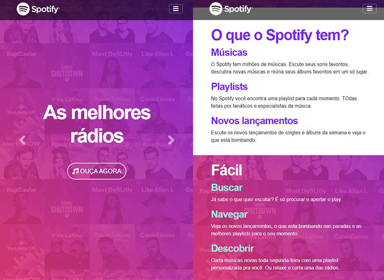
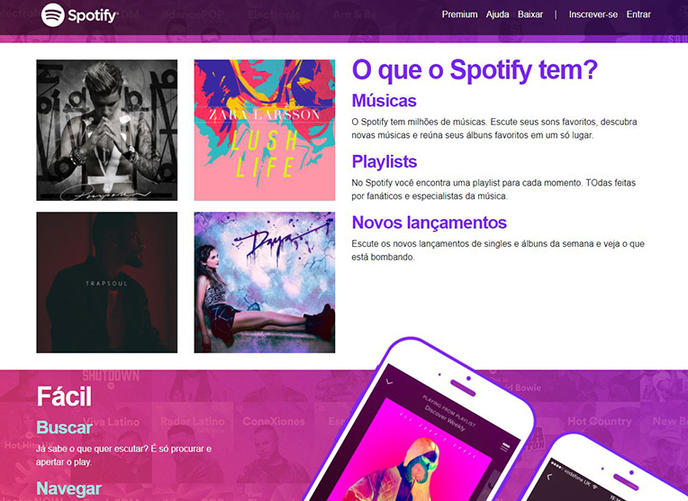
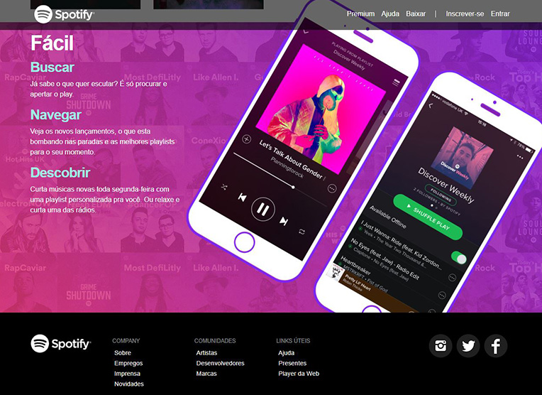
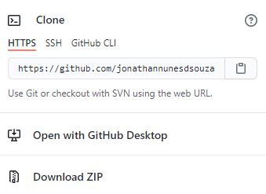

# Spotify
>Este projeto é uma réplica da home page do site [Spotify].

Este projeto é uma réplica da home page do site [Spotify] desenvolvida p/ com a intenção de aplicar os conceitos apreendidos em aula no curso [Domine Web] da [Udemy].

## Instalação

Para executar o projeto localmente o repositório deve ser clonado da forma desejada:

Com o repositório clonado, as alterações poderam ser feitas localmente sem problema algum.

## Histórico de atualização 

* 0.0.1;
    * Lançamento inicial.

## Meta 

Jonathan Douglas Nunes de Souza - [@jonathansouza] - <jonathannunes.souza98@gmail.com>

[@jonathansouza]:https://www.linkedin.com/in/perfil-in/

Distribuido sob licença. Veja **`LICENÇA`** para mais informações.

[https://github.com/jonathannunesdsouza/jonathannunesdsouza.github.io]

[Spotify]:https://wwww.spotify.com.br
[Domine Web]:https://www.udemy.com/course/web-completo/
[Udemy]:https://www.udemy.com/